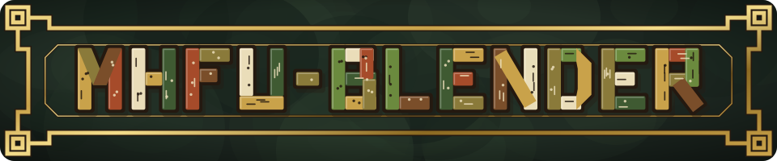

<p align="center">
  
</p>

# MHFU ModKit — Blender addon

Imports a Monster Hunter Freedom Unite big-monster model PAC into Blender as an armature,
skinned meshes and animations, and **exports edits back to an engine-valid PAC** through the
constraint validator — or pushes them to the running game. Thin `bpy` glue over the
[`formats`](https://github.com/MHFU-ModKit/formats) library, which does the format, the maths
and the validation; also the offline checks the MHP3rd→MHFU port pipeline uses (skin fidelity,
posed comparisons, clip renders).

## Install

```bash
git clone https://github.com/MHFU-ModKit/blender-addon.git
cd blender-addon/blender_mhfu
./build_addon.sh          # vendors the format library + produces blender_mhfu.zip
```

Blender → Edit > Preferences > Add-ons > Install… → pick `blender_mhfu.zip` → enable. Then
**File > Import > MHFU Monster (.bin)**. For development the addon also finds `mhfu_model` in
`tools/` when this checkout is used as is.

The user guide — what the import builds, what the export preserves, the live-inject path and the
size rule — is [`blender_mhfu/README.md`](blender_mhfu/README.md).

## Layout

```
blender_mhfu/          the addon, the render/compare scripts, tests
tools/mhfu_model/      the format library — a copy of MHFU-ModKit/formats at the same commit
```

## No game data is included

This repository contains **no game files, no extracted assets, no artwork** — not the ISO, not
decrypted archives, not models or textures, not dumped tables. All of it is gitignored and is
reproduced from your own legally obtained copy of the game (see the `formats` repo's
`docs/ASSETS.md`). Everything targets **MHFU EU (ULES01213)**; addresses will not line up with a
JP or NA build.

## About this repository

`blender-addon` is one of the [MHFU-ModKit](https://github.com/MHFU-ModKit) repositories. They are cut
from one upstream research repository and re-published from it, so they move in lockstep — a
file that appears in two of them is the same file at the same commit. Pull requests are welcome
here; an accepted one is applied upstream and comes back in the next export, which is why
`main` only takes changes through PRs. Issues are welcome for bugs, questions and findings alike.

The siblings:

- [`framework`](https://github.com/MHFU-ModKit/framework) — the runtime mod framework: one PRX, many mods, hot-reloaded Lua
- [`example-mods`](https://github.com/MHFU-ModKit/example-mods) — Lua mods and port manifests to learn from and drop on a memory stick
- [`monster-editor`](https://github.com/MHFU-ModKit/monster-editor) — the desktop editor for ported monsters
- [`hud`](https://github.com/MHFU-ModKit/hud) — a live read-only HUD and AI editor over the PPSSPP debugger
- [`formats`](https://github.com/MHFU-ModKit/formats) — the file-format library, ISO extraction and the MHP3rd→MHFU porter

## License

[MIT](LICENSE). Not affiliated with or endorsed by Capcom. Monster Hunter is a trademark of
Capcom Co., Ltd.
